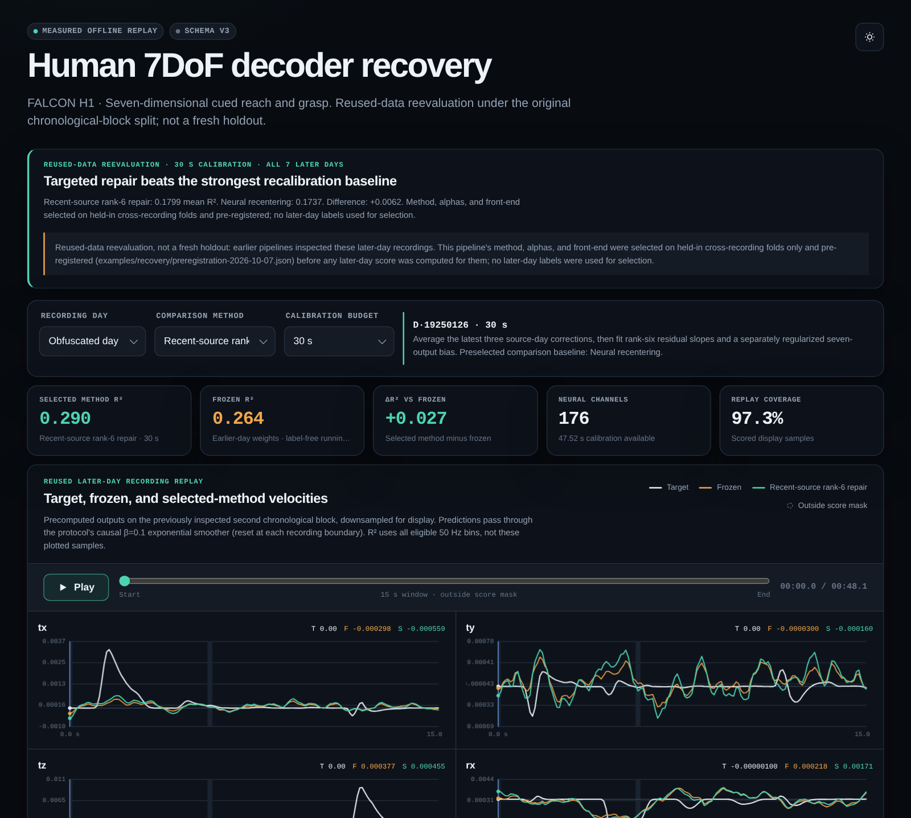

<h1 align="center">nd — Neural Decompiler</h1>

<p align="center"><b>Self-stabilizing, auditable brain-computer-interface decoders — compiled to streaming Rust.</b></p>

<p align="center">
  <a href="https://github.com/thebasedcapital/neural-decompile/actions/workflows/ci.yml"></a>
  <a href="https://doi.org/10.5281/zenodo.19339860"></a>
  
  
  <a href="LICENSE"></a>
</p>

**An intracortical decoder that is accurate yesterday drifts today.** `nd` treats decoders as programs: it diagnoses where they break, repairs them from seconds of data, compiles them to dependency-free streaming Rust, and—on small RNNs—certifies what algorithm they actually run.

<p align="center"></p>

**Contents:** [Quick start](#quick-start) · [Human decoder recovery](#human-decoder-recovery-across-days) · [Certified RNN repair](#the-result-perfect-fixtures-wrong-algorithm-certified-repair) · [Macaque BCI demo](#real-neural-data-decoder) · [CLI](#cli-examples) · [Reproduce](#reproduce-and-verify)

```text
human intracortical counts (176 ch, 20 ms bins)
        │  causal multi-tau filter (120/240/480 ms)          ┐
        │  causal running z-score, τ = 30 s, no labels       │ compiled to one
        │  frozen earlier-day ridge decoder (3,703 coeffs)   │ streaming Rust file,
        │  + optional 30 s rank-6 patch (3,217 scalars)      │ parity 1.04e-17
        ▼  causal output smoother                            ┘
   seven cued movement velocities, ~11 µs/bin incl. I/O
```

| Seven later days, FALCON H1 human data, 30 s calibration | New-day labels | Mean R² |
|---|---:|---:|
| Frozen decoder, earlier pipeline | none | 0.1212 |
| Neural recentering, earlier pipeline (its strongest baseline) | none | 0.1535 |
| Earlier deployed blend (candidate and alpha tuned on these later days) | 30 s | 0.1670 |
| **Frozen decoder + running z-score** | **none** | **0.1731** |
| Recentering + running z-score (strongest matched baseline) | none | 0.1737 |
| **Rank-6 patch + running z-score (pre-registered)** | 30 s | **0.1799** |

The label-free front-end alone beats every earlier configuration, including one tuned on the evaluation days. The pre-registered 30-second patch adds **+0.0062** over the strongest matched baseline and wins on **5 of 7** days. Every number is offline, open-loop, one participant, and reused-data evidence; details and disclosures below.

**Research:** [paper / DOI](https://doi.org/10.5281/zenodo.19339860) · [discussion](https://www.lesswrong.com/posts/MgydourqbPxopHSyC/neural-decompilation-we-decompiled-an-llm-attention-head). The manuscript and historical LLM-head notes ([`docs/`](docs/), `paper/`, parts of `results/`) are not fresh verification of this checkout.

## Quick start

```bash
git clone https://github.com/thebasedcapital/neural-decompile && cd neural-decompile
make recovery        # needs Rust + uv; fetches pinned public data once (~100 MB), ~2 min on a laptop CPU
xdg-open results/recovery.html   # or open it in any browser
```

## Human decoder recovery across days

```bash
make recovery          # downloads pinned FALCON H1 assets once, selects, evaluates, compiles Rust
make recovery-test     # causality, metric, patch, and front-end invariants
make recovery-benchmark  # development-only candidate benchmark (never opens later days)
# Open results/recovery.html: interactive 7-channel replay of every method, day, and budget.
```

Data: [FALCON H1 / DANDI 000954](https://dandiarchive.org/dandiset/000954/draft) — **176 channels, seven cued reach-and-grasp velocities, six earlier training days, seven later days**. On each later day the first recording supplies calibration; the second recording is scored. No GPU required; `uv` pins NumPy/h5py.

### What was wrong, and the fix

The earlier pipeline validated inside a single recording (calibration prefix → tail of the same file). Later-day scoring always crosses a recording boundary. That mismatch is why its supervised repair won development folds (0.39) and then collapsed on later days, prompting alpha and candidate reselection on the later days themselves.

**Cross-recording folds** reproduce the collapse using held-in days only: calibrate on recording 1, score recording 2. Under them the earlier rank-6 repair at its dev-chosen alpha 1 drops to **0.1635**, and the dev-optimal alpha moves to 30–100—what later days had shown. Searching on those folds alone found that a **causal running z-score** (every feature re-centred and re-scaled online with a 30 s forgetting window) beats both the earlier global normalization and a static calibration-prefix z-score (best rank-6 fold mean 0.2944 vs 0.2792 and 0.2663).

The front-end, τ, method, and alpha were fixed in [`preregistration-2026-10-07.json`](examples/recovery/preregistration-2026-10-07.json), committed before any later-day score was computed for them. `make recovery` reproduces the pre-registered numbers exactly.

| 30 s calibration | Cross-recording dev folds (3) | Later days (7) | Later-day per-day R² |
|---|---:|---:|---|
| Frozen | 0.2648 | 0.1731 | .264 .138 .106 .132 .207 .209 .155 |
| Recentering | 0.2667 | 0.1737 | .265 .139 .105 .134 .209 .209 .154 |
| Anchored ridge | 0.2631 | 0.1703 | .266 .128 .107 .117 .206 .217 .152 |
| New-day ridge | — | 0.0468 | |
| **Rank-6 patch, α = 100** | **0.2944** | **0.1799** | .290 .141 .096 .130 .228 .218 .156 |

At 45 s the patch reaches **0.1872** (anchored ridge 0.1819). Every method, budget (0/5/15/30/45 s), day, and per-output score is in [`recovery.json`](results/recovery.json) and the replay.

### On-implant shape

- **Label-free state:** 528 running means + 528 variances, updated each bin; initialized from 30 s of unlabeled activity.
- **Patch:** rank-6 slope correction (528×6 + 6×7) + 7 offsets = **3,217 scalars**, 13.1% fewer than the 3,703-coefficient decoder; requires the matching base and source-correction bank.
- **Compiled:** [`recovery_decoder.rs`](results/recovery_decoder.rs) is one dependency-free file (filters, z-score, decoder, smoother). Executed Rust matches Python on **17,233 bins from all seven evaluation recordings**, max absolute error **1.04e-17**; one process run took **10.9 µs/bin including I/O and startup**. That is replay parity on a desktop, not an all-input proof or implant latency.

### Disclosures

- **Reused data.** Earlier pipelines inspected these later-day recordings, so no later-day number here is a fresh holdout. The new pipeline used no later-day labels for selection; its designer knew the earlier results.
- **Base regularization is pinned at 1.0**, as in the pre-registered evaluation. Re-running the base-alpha search on cross-recording folds prefers 0.01 (frozen dev 0.3349); a full run with 0.01, executed after the pre-registered evaluation, gives later-day frozen 0.1707 and rank-6 0.1317. Near-day folds still over-reward weak regularization; reported, not hidden.
- **Margins are small.** The patch beats the label-free baseline by +0.0062 mean R²; most of the gain over the earlier pipeline (+0.020) comes from the label-free front-end.
- **Not the FALCON leaderboard.** This is a local chronological-block split on public calibration files; numbers are not comparable to official held-out FALCON scores. No clinical, closed-loop, or novelty claim. Dates are obfuscated.
- **Decompilation's role** here is execution fidelity (compiled replay), not decoding accuracy; no ablation shows decompilation improves R².
- **History.** Schema 1 (multi-tau features, causal smoother, rank-6 repair, then later-day-tuned blend) remains in git history; [`protocol.json`](examples/recovery/protocol.json) records the transition.

Data attribution: Ye, Joel; Jennifer L. Collinger; Robert Gaunt (2024), *FALCON Benchmark H1: Human 7DoF Reach and Grasp Motor BCI*, **CC-BY-4.0**, subject to the dataset's Data Use Agreement. The archive exposes a draft with validation status **Invalid**; [`manifest.json`](examples/recovery/manifest.json) pins all 40 asset IDs, sizes, SHA-256 digests, attribution, and usage conditions. Raw recordings and the regenerable 180 MB benchmark fixtures are cached locally and ignored by Git.

`make recovery-benchmark` rebuilds SHA-256-pinned cross-recording fixtures from cached held-in files, checks all five baselines against the selection record, and scores every candidate with exactly 30 s of calibration. It never opens later-day recordings. Current development advantage: **+0.0277** (rank-6 0.2944 vs recentering 0.2667; worst fold +0.0209).

`scripts/recovery/train_rnn.py` is a GPU-ready GRU sweep harness (zero-shot forward folds, early stopping on the last training day, never on the scored day). It has only a 3-epoch smoke run and contributes no reported result.

## The result: perfect fixtures, wrong algorithm, certified repair

The checked-in `divisible_by_3` RNN passes **254/254** examples. Automatic exact-state extraction finds that it implements a **7-state machine**, not the intended 3-state modulo algorithm. The shortest counterexample is `10100001` (161): the network accepts it, although `161 % 3 == 2`.

Searching **104 single-coefficient edits** to the quantized model finds **7 certified repairs**. The chosen repair deletes one recurrent edge: **`W_hh[3][0]: 1 -> 0`**. The repaired model minimizes to three states and its product with the specified modulo machine closes with no disagreement. This establishes equivalence for every finite binary sequence under exact integer semantics, without retraining.

For the repaired model, the conservative bound on every arithmetic intermediate is **24**. This also establishes exact execution of the recurrence in `f64` and `i64` on the declared binary input domain—not just mathematical-integer equivalence.

| Model | Reachable states before minimization | Minimal states | Result |
|---|---:|---:|---|
| Original `divisible_by_3` | 9 | 7 | Shortest failure: `10100001` |
| Repaired `divisible_by_3` | 5 | 3 | Equivalent to modulo-three specification |
| `contains_11` | 3 abstract states | 3 | Automatic saturation certificate, cap 2 |
| `no_consecutive_1` | 3 abstract states | 3 | Automatic saturation certificate, cap 2 |

```bash
# Requires uv; installs the pinned Z3 dependency automatically.
make breakthrough
make automata-test
```

The extractor does not read the specification while constructing the automaton. It first establishes exact reachable-state closure, or asks Z3 to prove an output-preserving saturation homomorphism over all nonnegative integer hidden states. Only then does it compare the resulting machine with a specification. State limits, solver timeouts, and noninteger residual weights yield **not certified**, never a guessed success.

Certificates, minimized executable Python, and the separate repaired model are written to `results/automata/`. The original trained weights are unchanged. See [the experiment and proof boundary](results/algorithm-extraction.md).

This is a working project result, **not a claim that automata extraction is new**; see [Weiss, Goldberg & Yahav, ICML 2018](https://proceedings.mlr.press/v80/weiss18a.html). The current repair search is a finite, explicit neighborhood around a known-specification toy task—not general neural program repair or a BCI safety guarantee.

## Run the demo

Requires Rust/Cargo, Make, Bash, and Python 3 for emitted-program checks.

```bash
cargo install --path .
make demo
make bench
make test
```

`make demo` decompiles the `contains_11` RNN, checks its fixture labels, and writes a circuit report. `make bench` regenerates [the benchmark table](results/benchmark.md) from the checked-in models and test sets. It captures the deliberately failing `bitwise_xor` and `mod5` verification exits in an explicit **Expected failure** column, continues through those rows, and aborts on unexpected failures or unexpected passes of those tasks.

The original substring detector has two hidden neurons, one inactive. Its active recurrence is:

```python
h = max(0, 2*h - x[0] + 2*x[1] - 1)
```

For one-hot binary inputs, the output recognizes whether `11` has occurred. The included 62-case fixture checks binary strings of lengths 1–5. It does not establish arbitrary-length machine arithmetic: this recurrence can grow without bound.

The divisibility-by-three model has **five stored hidden neurons, four active in its circuit analysis**. The included 254 cases cover lengths 1–7. Those are fixture results, not unseen-data generalization.

## Real neural-data decoder

```bash
make bci
```

This pipeline uses [MC_Maze_Small, DANDI 000140](https://dandiarchive.org/dandiset/000140), macaque motor and dorsal premotor cortex recordings, to classify reach quadrant from spike counts. It downloads data, prepares trial features, trains a small decoder, exports `nd` weights and held-out cases, and evaluates the extracted program. Python dependencies are managed by `uv`; no GPU is required.

The downloaded training asset contains **100 trials, 142 sorted units, and a published 75/25 train/validation split**. Our offline demonstration uses the validation partition as its held-out evaluation; it is not a score on the official NLB hidden test set. See [the BCI report](results/bci.md) for the actual training configuration, trial IDs, accuracy, majority baseline, quantization fidelity, and unit-dropout measurements.

The frozen decoder scores **21/25 (84%)**, versus **9/25 (36%)** for the majority baseline. Executed emitted Python and compiled Rust both reproduce all **25/25** saved float-model predictions. This is measured emission fidelity, not an all-input equivalence proof.

The distinction between measurements matters:

- **Task accuracy:** predictions compared with recorded reach labels.
- **Quantization fidelity:** predictions before and after quantization agree.
- **Emission fidelity:** the emitted program agrees with the numerical model.
- **Unit-dropout sensitivity:** prediction changes when a recorded input unit is zeroed, without retraining.

High fidelity does not imply high task accuracy. Unit dropout is a decoder sensitivity experiment, not evidence that a biological neuron causes a movement, nor a physical electrode-failure simulation.

**Limits:** offline, single subject/session, small evaluation set, movement-aligned windows, no implant deployment, no clinical validation, and no formal proof of the neural-data decoder. Post-onset spikes cannot support a claim of prospective intent prediction. This is a tool for auditing a decoder—not “reading the brain's source code.”

Data attribution: Churchland, Mark; Kaufman, Matthew (2022), *MC_Maze_Small: macaque primary motor and dorsal premotor cortex spiking activity during delayed reaching*, DANDI 000140, **CC-BY-4.0**. Source metadata and preprocessing provenance accompany the BCI artifacts. Raw recordings are cached locally, not committed.

## CLI examples

```bash
# Extract and execute readable code
nd decompile examples/regex/contains_11.json --output /tmp/contains_11.py
nd decompile examples/regex/contains_11.json --format rust

# Label accuracy of the internal quantized RNN runtime
nd verify examples/regex/contains_11.json examples/regex/contains_11_tests.json
nd stats examples/regex/contains_11.json
nd trace examples/regex/contains_11.json 1,0,1,1

# Structural comparison and inspection
nd compare examples/regex/contains_11.json examples/regex/no_consecutive_1.json
nd xray examples/regex/divisible_by_3.json examples/regex/divisible_by_3_tests.json

# GGUF inspection (requires your model file)
nd layers model.gguf
nd extract model.gguf --tensor blk.0.attn_q.weight
nd intmap model.gguf
```

Additional commands include `slice`, `diagnose`, `taxonomy`, `evolve`, `diff`, and `patch`; run `nd <command> --help` for options. `patch` supports the emitted RNN expression subset, not arbitrary Python.

## Formats and semantics

RNN weight JSON contains `W_hh`, `W_hx`, `b_h`, `W_y`, and `b_y`. The recurrence is:

```text
h_0 = 0
h_t = ReLU(W_hh @ h_(t-1) + W_hx @ x_t + b_h)
y   = first argmax(W_y @ h_T + b_y)
```

RNN test JSON is an array of `{"inputs": [[...], ...], "expected": 0}` objects. Transformer cases use `{"tokens": [...], "expected": 0}` instead.

Quantization snaps a weight only when its distance to the nearest integer is **strictly less than epsilon**; other weights stay floating-point. L1 promotes sparsity; the training scripts use a separate integer-distance penalty to encourage integer alignment. This repository does not establish a controlled superiority result over the MIPS normalization pipeline.

`decompile`, `verify`, and `xray` share architecture defaults: **0.15 for RNNs, 0.01 for transformers**. All three honor an explicit `--eps`; use the same value when comparing their results. The benchmark passes per-architecture epsilons explicitly (`RNN_EPS=0.15`, `TRANSFORMER_EPS=0.01` by default; legacy `EPS` overrides only the RNN value). Transformer xray weight statistics and emitted source use that epsilon; its per-layer attention/activation traces are explicitly labeled as using original weights.

Source emission retains nonzero residual coefficients and round-trippable floating-point literals; it does not apply a second rounding pass. This preserves coefficient values, not a general proof of bitwise-identical floating-point evaluation.

RNN `verify` checks the internal quantized runtime against fixture labels; it does not execute emitted source. Transformer verification additionally checks original-versus-quantized final logits with **absolute error < 0.01** and classification agreement. This is not a relative 1% tolerance or exact numerical equivalence. Emitted-program execution is covered separately by behavioral checks.

`verify` exits **0 only for a nonempty test set with every fixture passing**. Failed fixtures and empty fixture arrays print a `FAIL` summary and exit **1**; an empty set is never reported as `PERFECT`.

Transformer Python and Rust emission includes all optional attention and feed-forward block biases (`b_q`, `b_k`, `b_v`, `b_o`, `b_ff_in`, `b_ff_out`). `--format circuit` instead produces **non-executable heuristic analysis**, labeled as such: inferred head patterns and selected FFN neurons, not a forward pass, certified circuit, or replacement for Python/Rust emission.

GGUF v2/v3 inspection supports F32, F16, BF16, Q8_0, and Q4_0 tensors. Inspecting an LLM tensor is not equivalent to decompiling or verifying an entire LLM.

## Reproduce and verify

| Command | Purpose |
|---|---|
| `make build` | Release CLI |
| `make test` | Behavioral Rust/CLI tests |
| `make demo` | Substring circuit and HTML circuit report |
| `make bench` | Regenerate fixture benchmark |
| `make train` | Retrain the added synthetic task fixtures |
| `make bci` | Real-data preparation, training, extraction, evaluation |
| `make proofs` | Kani harnesses; Kani installation required |
| `make breakthrough` | Extract, falsify, repair, and replay automata certificates |
| `make automata-test` | Soundness boundaries, repair, and tamper-rejection tests |
| `make recovery` | Human BCI decoder recovery: select, evaluate, compile Rust, render replay |
| `make recovery-test` | Causality, metric, patch, and running z-score invariants |
| `make recovery-benchmark` | Development-only candidate benchmark on cross-recording folds |

For Kani setup:

```bash
cargo install --locked kani-verifier
cargo kani setup
make proofs
```

See [proof claims and results](kani-proofs/RESULTS.md) for each harness's domain and execution status. Bounded checks quantify over the declared input lengths. Inductive checks concern the explicitly defined abstract or saturated transition system; they must not be presented as unlimited-length correctness of an overflowing `i64` implementation. Toy-circuit proofs do not transfer to the BCI decoder.

The CNN-transformer experiment under `examples/cnn_transformer/` is a standalone experiment/specification, not a supported `nd` architecture.

## Background and license

Inspired by [MIPS: Opening the AI Black Box](https://arxiv.org/abs/2402.05110). This project explores direct weight-to-program extraction, complementary circuits, numerical fidelity, and explicitly scoped formal verification.

MIT for code. Dataset licenses remain separate.
